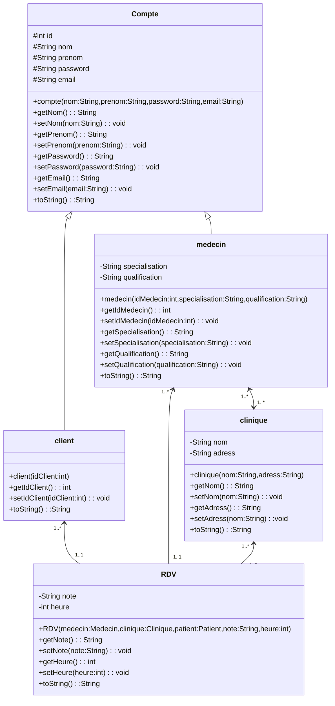

```mermaid
classDiagram
    Compte<|--client
    Compte<|--medecin
    medecin"1..*"<--"1..1"RDV
    client"1..*"<--"1..1"RDV
    clinique"1..*"<--"1..1"RDV
    medecin "1..*"<-->"1..*" clinique

    class Compte{
      #int id  
      #String nom
      #String prenom
      #String password
      #String email
      +compte(nom:String,prenom:String,password:String,email:String)
      +getNom(): String
      +setNom(nom:String): void
      +getPrenom(): String
      +setPrenom(prenom:String): void
      +getPassword(): String
      +setPassword(password:String): void
      +getEmail(): String
      +setEmail(email:String): void
      +toString():String
    }
    class client{
      +client(idClient:int)
      +getIdClient(): int
      +setIdClient(idClient:int): void
      +toString():String
    }
    class medecin{
      -String specialisation
      -String qualification
      +medecin(idMedecin:int,specialisation:String,qualification:String)
      +getIdMedecin() : int
      +setIdMedecin(idMedecin:int) : void
      +getSpecialisation(): String
      +setSpecialisation(specialisation:String): void
      +getQualification(): String
      +setQualification(qualification:String): void
      +toString():String
    }
    class RDV{
        -String note
        -int heure
        +RDV(medecin:Medecin,clinique:Clinique,patient:Patient,note:String,heure:int)
        +getNote(): String
        +setNote(note:String): void
        +getHeure(): int
        +setHeure(heure:int): void
        +toString():String
    }
    class clinique{
        -String nom
        -String adress
        +clinique(nom:String,adress:String)
        +getNom(): String
        +setNom(nom:String): void
        +getAdress(): String
        +setAdress(nom:String):void 
        +toString():String
    }
```